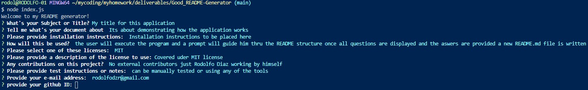
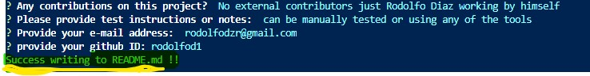
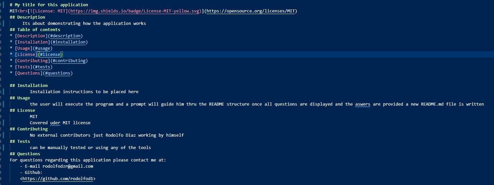

# **Good-README-Generator**
MIT 

## About this application:
Node.js Command-line application  for quick and easy README files to get started.

## Table of contents:
* [Good Readme Generator](#good-readme-generator)
* [About](#about-this-application)
* [Usage](#usage)
* [Installation](#installation)
* [License](#license)
* [Testing](#special-testing-instructions)
* [In case of Questions](#in-case-of-questions)
* [Link to video](#link-to-video)

## Usage:
-----------
This 'Node.js' application can be used by any one who would like to save time and still have a good README baseline that complies with the most used guidelines on making .md files.
a command line prompt will guide the user thru a series of questions directed to auto populate the README.md file once all the questions of the prompt are done. 

- Here it is an example of the questions prompted when the application is started:
    

- Once all questions are completed an alert is displayed.
    

- This is an example of the written file once the program is completed. 
    

## Installation:
-----------
The application requires 'inquirer' and 'util' node packages. 
Run 'npm install inquirer' and 'npm install util' before executing 'node index.js'

## License
-----------
I have used the MIT license for this application see repository documentation 
<https://github.com/Rodolfod1/Good_README-Generator/blob/main/LICENSE>

## Testing
----------
This can be manually tested or using any test tool

## Link To Video demonstrating the app:
<https://drive.google.com/file/d/1cfpXKgbaim9Qz4q2F_ox29llT9KDcqo3/view>

## In case of questions:
Please contact me at my e-mail: 
rodolfodzr@gmail.com

Follow me on Github
<https://github.com/Rodolfod1>

